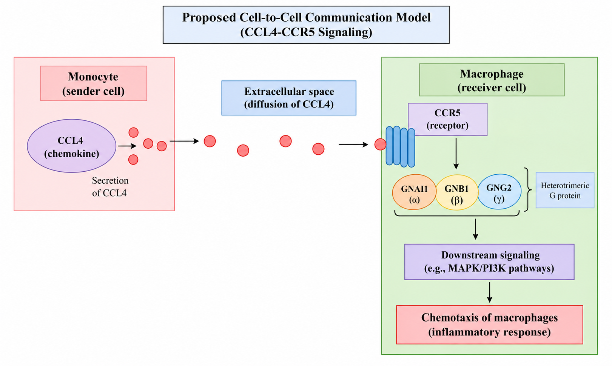

# Cell-to-Cell Communication Laboratory: CCL4–CCR5 Signaling

## Biological Question

How can monocytes communicate with macrophages through CCL4–CCR5 signaling during inflammatory signaling?

## Chosen Sender Cell and Biological Context

| Item | Answer |
|---|---|
| **Sender cell** | Monocyte |
| **Biological context** | Inflammation / immune signaling |
| **Main purpose** | Communication between immune cells through a secreted chemokine |

## Candidate Ligand and Evidence for Sender-Cell Expression

| Item | Information |
|---|---|
| **Sender cell** | Monocyte |
| **Candidate ligand** | CCL4 |
| **Gene** | CCL4 |
| **Protein name** | C-C motif chemokine ligand 4 |
| **Predicted location** | Secreted |
| **Expression evidence** | The Human Protein Atlas (HPA) shows CCL4 as cell-type enhanced in monocytes, among other immune cell types. |
| **Protein evidence** | HPA reports evidence at the protein level. |
| **Extracellular evidence** | HPA predicts CCL4 to be secreted. |
| **Supporting database** | Human Protein Atlas |

## Receptor and Receiver Cell with Supporting Evidence

| Item | Information |
|---|---|
| **Ligand** | CCL4 |
| **Receptor** | CCR5 |
| **Receiver cell** | Macrophage |
| **Receptor protein** | C-C motif chemokine receptor 5 |
| **Receptor localization** | Membrane |
| **Receiver-cell evidence** | HPA shows CCR5 expression/enrichment in immune cell types including macrophages. |
| **Signaling context** | Immune / inflammatory signaling |
| **Supporting databases** | Human Protein Atlas and OmniPath |

## OmniPath Findings

| Component | Gene | Finding |
|---|---|---|
| **Ligand** | CCL4 | Secreted ligand |
| **Receptor** | CCR5 | Candidate receptor for CCL4 |
| **Interaction** | CCL4 → CCR5 | Stimulatory interaction |
| **References** | — | 44 references shown in OmniPath |
| **Intercellular annotation** | CCL4 | Secreted / locational |
| **Intercell sources** | — | UniProt_keyword, UniProt_location, HPA_secretome, connectomeDB2020, Baccin2019, Matrisome, Cellinker, and OmniPath |

OmniPath therefore supports the role of CCL4 as a secreted signaling molecule and identifies CCR5 as a receptor associated with CCL4 signaling.

## STRING Network Interpretation

The STRING network contained **11 nodes and 36 edges**, with CCL4 and CCR5 among the central proteins. Relevant proteins identified from the network include:

- **CCL4**
- **CCR5**
- **GNAI1**
- **GNB1**
- **GNG2**

The network showed significant functional enrichment. Relevant biological processes included **chemokine-mediated signaling pathway**, **cell chemotaxis**, **leukocyte chemotaxis**, and **cytokine-mediated signaling pathway**. The **chemokine signaling pathway** was also significantly enriched in the KEGG pathway analysis.

These findings are consistent with a chemokine-mediated inflammatory signaling mechanism. However, STRING represents functional protein associations and does not automatically demonstrate direct physical binding or establish the direction of a signaling pathway.

## IntAct Validation

| Item | Information |
|---|---|
| **Protein pair examined** | GNB1 – GNAI1 |
| **Organism** | *Homo sapiens* |
| **Interaction type** | Physical association |
| **Detection method** | 3D electron microscopy (3d-em) |
| **Positive interaction** | Yes |
| **Publication** | PMID: 35501348 |
| **Interpretation** | The IntAct record supports a physical association between GNB1 and GNAI1. This evidence does not by itself prove the complete CCL4–CCR5 signaling pathway. |

The initial CCL4–CCR5 search did not provide a useful curated IntAct record for the proposed interaction, so an additional protein pair from the STRING network was examined.

## Final Model

The proposed signaling sequence is:

**Monocyte → CCL4 → CCR5 → Macrophage → G-protein signaling → Chemotaxis / inflammatory response**

**Figure 1.** Proposed CCL4–CCR5 cell-to-cell communication model showing the monocyte sender cell, secretion of CCL4 into the extracellular space, CCR5 on the macrophage receiver cell, downstream G-protein signaling, and the proposed chemotactic/inflammatory response.

### Interpretation

My proposed model shows communication between a **monocyte and a macrophage through the secreted chemokine CCL4**. The Human Protein Atlas supports CCL4 as a secreted protein and shows that it is **cell-type enhanced in monocytes**, which supports my choice of CCL4 as the candidate signal. HPA also provides protein-level evidence and predicts that CCL4 is secreted. OmniPath identifies CCL4 as a **secreted ligand** and shows a **stimulatory CCL4–CCR5 interaction** supported by multiple references. CCR5 is a membrane receptor and is associated with immune cell types, including macrophages, making macrophages a reasonable receiver cell.

The STRING network connects CCL4 and CCR5 with signaling-related proteins such as **GNAI1, GNB1, and GNG2**. Its enrichment results include **chemokine-mediated signaling and leukocyte chemotaxis**, which are consistent with the proposed inflammatory response. However, STRING shows functional associations and does not automatically prove direct physical interactions or the direction of the pathway. IntAct provided experimental evidence for a physical association between **GNB1 and GNAI1 using 3D electron microscopy**. Overall, the ligand, receptor, and protein-network components are supported by database evidence, while the specific **monocyte-to-macrophage communication and resulting chemotactic response remain a proposed biological inference**.

# Questions and Answers

## 1. What sender cell did you choose, and in what tissue or biological context does it act?

I chose the **monocyte** as my sender cell. I selected it because monocytes are immune cells involved in **immune and inflammatory responses**, which provides a biologically relevant context for cell-to-cell communication.

## 2. What signaling molecule did you identify, and what evidence supports its production or presentation by the sender cell?

I identified **CCL4 (C-C motif chemokine ligand 4)** as the signaling molecule. Based on the Human Protein Atlas, CCL4 is **cell-type enhanced in monocytes**, with protein-level evidence. HPA also predicts that CCL4 is **secreted**, supporting its role as a signaling molecule released by the sender cell.

## 3. What receptor receives the signal, and which receiver cell did you select?

I selected **CCR5 (C-C chemokine receptor 5)** as the receptor and **macrophage** as the receiver cell. OmniPath shows a **CCL4 → CCR5 stimulatory interaction** with multiple supporting references. HPA also shows CCR5 expression associated with immune cell types, including macrophages.

## 4. What type of cell-to-cell signaling is represented: paracrine, endocrine, autocrine, or contact-dependent?

I classified my proposed interaction as **paracrine signaling** because CCL4 is a secreted chemokine that can act on a different cell through the CCR5 receptor. However, I consider the specific monocyte-to-macrophage classification as an inference based on the available evidence.

## 5. Which proteins in your STRING network appear most relevant to the receptor-associated response? Explain briefly.

The proteins I considered most relevant are **CCR5, GNAI1, GNB1, and GNG2**. CCR5 is the receptor, while GNAI1, GNB1, and GNG2 are associated with heterotrimeric G-protein signaling. These proteins provide a possible connection between CCR5 activation and downstream cellular signaling.

## 6. What enriched pathway or biological process is consistent with your proposed mechanism?

The STRING analysis showed enrichment for **chemokine-mediated signaling, cell chemotaxis, leukocyte chemotaxis, cytokine-mediated signaling, and leukocyte migration**. These processes are consistent with my proposed CCL4-CCR5 signaling model and support a role in immune-cell communication and movement.

## 7. What did IntAct show for the molecular interaction you examined? What type of evidence was reported?

I examined an interaction involving **GNB1 and GNAI1** in IntAct. The record showed a **positive physical association** detected using **3D electron microscopy (3d-em)** in an in-vitro host organism context. The record was associated with **PubMed 35501348**. This supports a physical interaction between the proteins, although it does not by itself prove the complete CCL4-CCR5 signaling pathway in my proposed cells.

## 8. Which parts of your final model are strongly supported, and which parts remain an inference?

The strongest evidence supports **CCL4 as a secreted signaling molecule**, the **CCL4-CCR5 interaction**, and the involvement of chemokine-related signaling and G-protein-associated proteins. The choice of **monocyte as the sender and macrophage as the receiver**, as well as the exact direction and cellular context of the complete pathway, involves some inference from the database evidence.

## 9. What cellular response is expected in the receiver cell, and why?

The expected response is **macrophage chemotaxis and an inflammatory response**. I proposed this because CCL4 is a chemokine, CCR5 is a chemokine receptor, and the STRING enrichment results included **cell chemotaxis, leukocyte chemotaxis, and leukocyte migration**.

## References and Database Links

- **Human Protein Atlas:** https://www.proteinatlas.org/
- **OmniPath:** https://omnipathdb.org/
- **STRING:** https://string-db.org/
- **IntAct:** https://www.ebi.ac.uk/intact/
- **UniProt:** https://www.uniprot.org/
